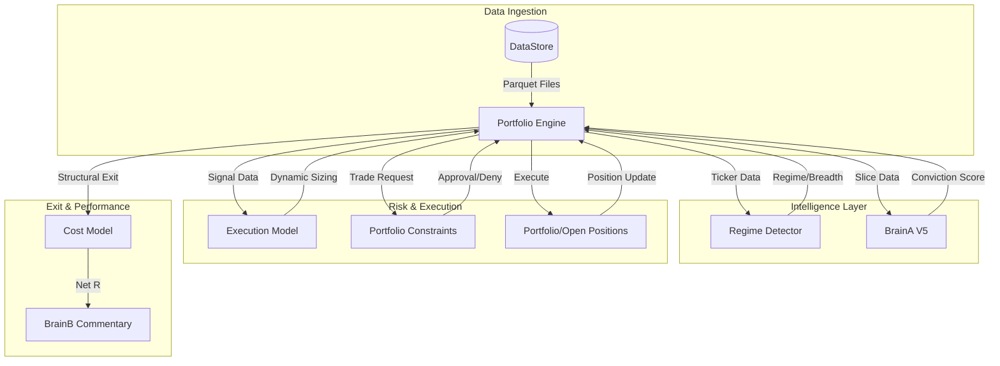
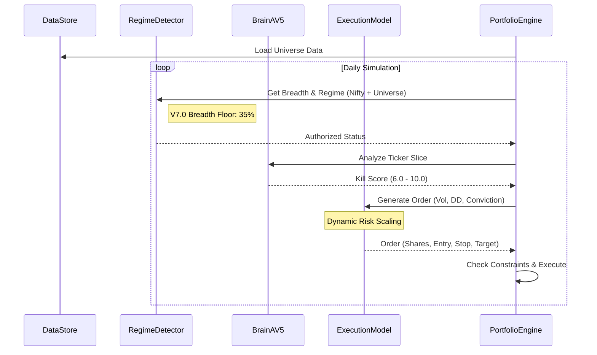

# Sovereign AI Trading Engine V7.0 (The Quant Institutional) 🦅

A top-tier quantitative trading ecosystem for the Indian Stock Market (NSE), hardened with **Dynamic Alpha Sizing**, **Portfolio Volatility Targeting**, and **Market Breadth Intelligence**.

---

## 🚀 Quick Start

```bash
# 1. Install dependencies
pip install -r requirements.txt

# 2. Configure your Gemini API key (used for the BrainB AI commentary layer in the dashboard;
#    core signal/sizing/risk logic is fully deterministic and works without it)
cp .env.example .env
# then edit .env and set GEMINI_API_KEY=<your real key>

# 3. Run the test suite (83 tests, no API key or network required)
python -m pytest tests/ -v

# 4. Launch the live dashboard
streamlit run src/app_v6.py
```

**Note:** The dashboard's "Check Market Regime" and "Run Scan" actions fetch live data via `yfinance` (Yahoo Finance) at runtime — an internet connection with access to Yahoo Finance is required for the live demo. If that data fetch fails for any reason, the system is designed to degrade gracefully to a "Neutral" regime rather than crash (verified in `src/scanner.py`).

Other useful entry points:
```bash
python run_certification.py     # Backtest tearsheet across 3 benchmark tickers
python run_portfolio_sim.py     # Full-universe portfolio simulation
```

---

## 🏗️ System Architecture (V7.0 Sovereignty)

The system operates on an **Advanced Multi-Factor Risk Architecture**, decoupling data ingestion, signal generation, and risk execution.

### High-Level Component Diagram


### Data Flow Lifecycle


---

## 🦅 V7.0 Advanced Strategy Pillars

### 1. Dynamic Position Sizing (`src/execution/model.py`)
Risk is no longer fixed. Sizing scales dynamically based on:
- **Conviction Multiplier**: 0.75x to 1.25x based on Kill Score (6.0 - 10.0).
- **Drawdown Scalar**: Reduces exposure by up to 50% when approaching 15% Max DD.
- **Volatility Scalar**: Normalizes risk against a 12% annualized portfolio vol target.

```python
# Sizing Logic (ExecutionModel.calculate_dynamic_risk)
conviction = config.CONVICTION_MIN_MULT + \
            (kill_score - config.KILL_SCORE_THRESHOLD) / \
            (10.0 - config.KILL_SCORE_THRESHOLD) * \
            (config.CONVICTION_MAX_MULT - config.CONVICTION_MIN_MULT)

dd_scalar = max(0.5, 1.0 - (current_dd / config.MAX_DD_THRESHOLD) * 0.5)

annualized_vol = portfolio_vol * (252 ** 0.5)
vol_scalar = min(1.5, config.TARGET_PORTFOLIO_VOL / annualized_vol) if annualized_vol > 0 else 1.0

final_risk = self.base_risk_inr * conviction * dd_scalar * vol_scalar
```

### 2. Market Breadth Intelligence (`src/regime.py`)
- **Universe Scan**: Real-time calculation of % of stocks above their 50-day EMA.
- **Institutional Veto**: Automatically halts all long entries if breadth falls below **35%**, even if Nifty is bullish.

```python
# Breadth Score (RegimeDetector.get_breadth_score)
def get_breadth_score(self, universe_data: dict, timestamp: pd.Timestamp) -> float:
    total = 0
    above = 0
    for ticker, df in universe_data.items():
        if ticker == "^NSEI": continue
        if timestamp in df.index:
            total += 1
            if 'EMA_50' in df.columns:
                if df.loc[timestamp]['Close'] > df.loc[timestamp]['EMA_50']:
                    above += 1
    return above / total if total > 0 else 0.5
```

### 3. Structural Exit Logic (`src/backtest/position.py`)
Exits trades before they hit stop/target if the "Alpha Edge" evaporates:
- **RS Deterioration**: RS Score falls below the minimum threshold (0.05 percentage points).
- **Structure Break**: Price closes below the 20-EMA (Longs).
- **Volatility Collapse**: Realized ATR falls below 50% of entry ATR.

---

## 🔄 Project Version History

| Version | Milestone | Key Features |
| :--- | :--- | :--- |
| **V8.0** | **Alerts & Notifications** | Added Telegram and Email alerts via AlertManager with deduplication. |
| **V7.2** | **Stability & State Isolation** | Fixed cross-ticker state leakage in multi-ticker runs, resolved trade report `NameError`, added engine unit tests. |
| **V7.1** | **Resilience & Safety** | BrainB UI integration, Capital & Leverage Limits, 59-day Backtest Engine dates, E2E integration testing, and 83 active tests. |
| **V7.0** | **The Quant Institutional** | Dynamic Sizing, Portfolio Vol Targeting, Market Breadth, Structural Exits. |
| **V6.5** | **Regime Sovereignty** | Unified RegimeDetector, Multi-Factor constraints, Parquet Optimization. |
| **V6.0** | **Bayesian Brain** | BrainAV5 (Kill Score logic), ATR-based stops, Multi-ticker backtesting. |
| **V5.0** | **Foundations** | Initial Portfolio Engine, Basic technical indicators, CSV data support. |

---

## 🧪 Verification & Reliability

- **Universal Test Suite**: 83 active tests coverage including Portfolio Engine E2E tests, multi-ticker state isolation logic, and AlertManager components.
- **Dynamic Sizing Tests**: Verified conviction scalars (7.5k - 12.5k risk bands).
- **Structural Exit Tests**: Verified automated exits on RS/EMA/ATR shifts.
- **Breadth Verification**: Verified veto triggers on weak market internalities.

Run full verification:
```bash
python -m pytest tests/ -v
```

---

## ⚡ Key Parameters (V7.0)

| Parameter | Value | Logic |
| :--- | :--- | :--- |
| **Annual Vol Target** | `12%` | Global portfolio stabilization |
| **Max DD Limit** | `15%` | Defensive risk scaling threshold |
| **Breadth Floor** | `35%` | Universe health requirement |
| **Gap Multiplier** | `1.5x ATR` | Volatility-aware gap protection |
| **Risk Multiplier** | `0.75 - 1.25` | Conviction-based sizing band |

---

*Phase 7 Upgrade: Quant-Institutional Grade Achieved.*
